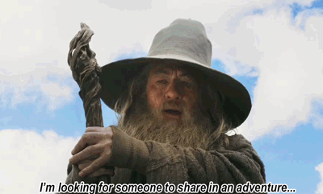

```rust
#[allow(dead_code)]
#[derive(Debug)]
struct Person {
    full_name: &'static str,
    country: &'static str,
    age: u8,
    back_end: &'static [&'static str],
    front_end: &'static [(&'static str,&'static [&'static str])],
    low_level: &'static [(&'static str,&'static [&'static str])]
}

fn main() {
    let murielberehulka = Person {
        full_name: "Muriel Guedes Pucci Berehulka",
        country: "Brasil",
        age: 21,
        back_end: &[
            "Rust",
            "C++",
            "NodeJS"
        ],
        front_end: &[
            ("Web", &[
                "HTML",
                "CSS",
                "JS"
            ]),
            ("Desktop", &[
                "C#", //WPF stuff
                "C++",
                "Rust" //surprise mf :D
            ])
        ],
        low_level: &[
            ("Eletronics", &[
                "Arduino",
                "ESP8266",
                "ESP32",
                "MOS6502" //😎
            ]),
            ("Misc", &[
                "Assembly"
            ])
        ]
    };
    println!("{:?}", murielberehulka);
}
```